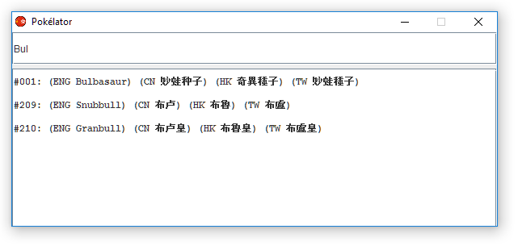
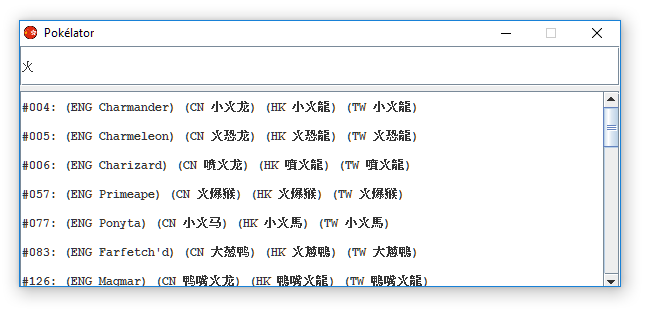

# The Pokélator 
Pokémon Sun and Moon will finally include the options to play the game in Chinese!
For those of us who grew up with the English Pokémon names, there will be an initial hurdle to overcome to learn the more-than-seven-hundred names in a new language.

This tool will help with that.
It has a simple interface with a search box, and a box with search results in each language.
Anything can be entered into the search box. If there is a hit in the Pokédex number, English name, name in simplified Chinese or in traditional Chinese, the hits will be listed showing each of those fields. Partial hits will also be shown.

The cantonese names used in Hong Kong are also included, even though they will unfortunately not be in the officially translated versions of the games.

# 精灵宝可梦名字翻译软件
精灵宝可梦太阳版和月亮般的官方版终于可以选择用中文玩了！不用在网上下载汉化版了。
但是有的人（我）有二十多年的历史一直玩英文版的游戏现在换中文版有大困难：精灵的名字大不相同！有七百多种精灵，看到一个名字猜不出来是英文的哪种精灵。

这个工具就是翻译精灵宝可梦的名字的。
界面很简单。输入一个名字或者一个号码，结果表就会显示精灵的名字：英文、简化（大陆）、繁体（台湾）、繁体（香港）都包括。

香港的精灵名字包括在里面，即使任天堂这次选择用普通话的名字标准化。

# Running the tool 
The tool is written in Java. You must have Java installed on your system to run the application. It should work on pretty much any computer with Java installed.
You can download the application [here](https://github.com/gwaerondor/PokeLator/raw/master/Pok%C3%A9lator.jar).

# 软件怎么跑
这个工具是用Java写的。要用的话必须在你的系统安装先Java。[下载翻译工具](https://github.com/gwaerondor/PokeLator/raw/master/Pok%C3%A9lator.jar)

# How to use it
The interface has only two parts: the search bar and the result list. You can enter anything in the search bar, and if any part of any pokémon's name matches the search string, it will be displayed in the results list. See the example screenshots below.

# 软件怎么用
界面只有两个部分：上面的搜索框和下面的结果表。你可以在搜索框里输入任何语言的任何东西。符合搜索条件的精灵就会显示在下面的结果表。截图如下。

# Current status
## Done
* Searching
* Importing the name database into the program
* GUI listening to typing events so it can update hits in real time
* Dumping the name database from Bulbapedia.

## Kind of done
* GUI (Cannot be resized at the moment, I turned it off because I couldn't get the components to scale properly)

## Not done
* Nicer representation of languages, maybe with flag icons.

## Maybe in the future
* Clickable results that will bring up additional information about the selected pokémon (pokédex entries in the different languages, pinyin, jyutping)
* Adding a searchable database of move names that works much the same as the monster name database.
* Separate the search logic from the GUI thread
* Android app
